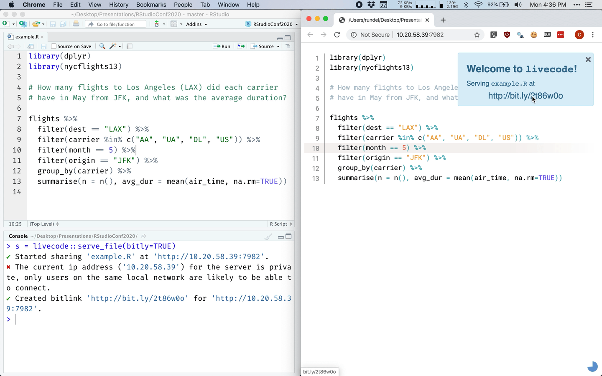

# livecode

<!-- badges: start -->

<!-- badges: end -->

<!-- -->


## Installation

You can install the development version of `livecode` from this GitHub repository:

``` r
remotes::install_github("rundel/livecode")
```

## Example

``` r
# From RStudio with an open R script
server = livecode::serve_file()
#> ✔ Started sharing 'example.R' at 'http://192.168.1.128:30000'.
#> ✖ The current ip address ('192.168.1.128') for the server is private, only users on the same local network are likely to be able to connect.

# Once started, send messages to your users.
server$send_msg("Hello World!", type = "success")
server$send_msg("Oh no!\n\n Something bad has happened.", type = "error")

# Once finished, shut the server down.
server$stop()
#> ✔ Stopped server at 'http://192.168.1.128:30000'.
```

